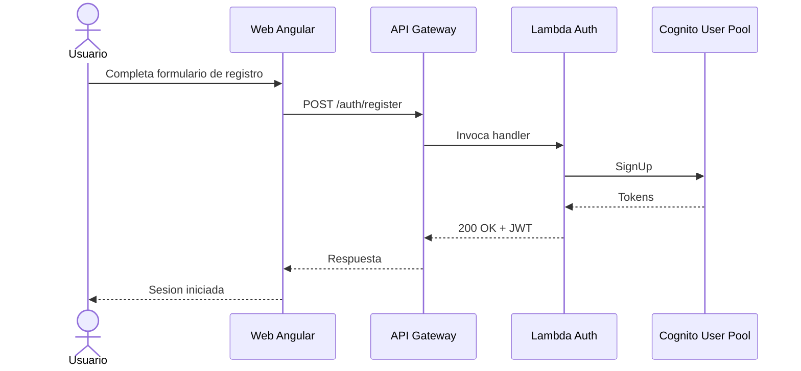
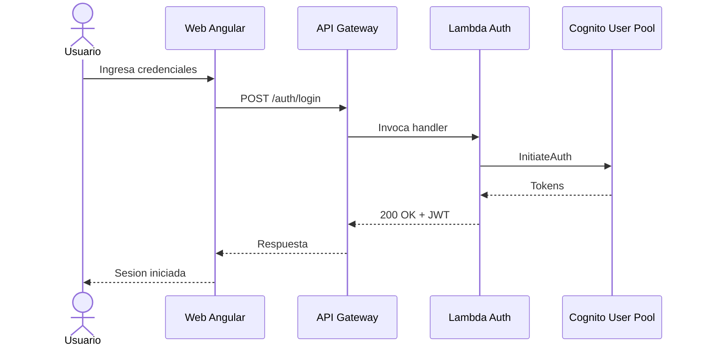
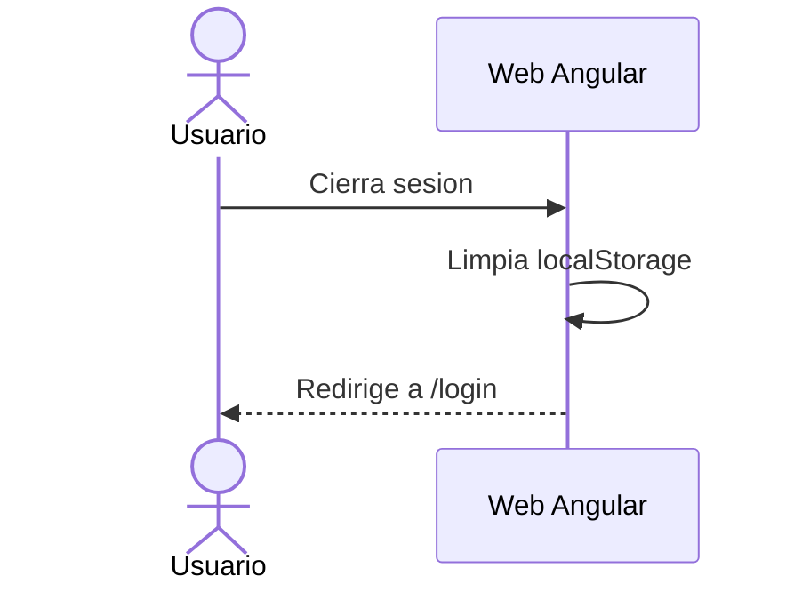
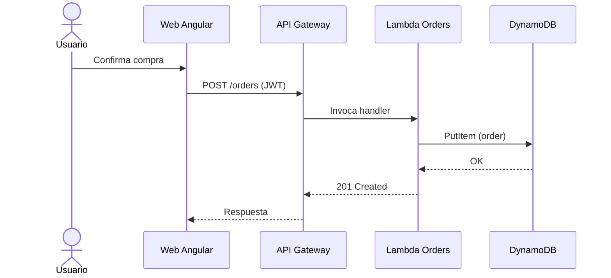
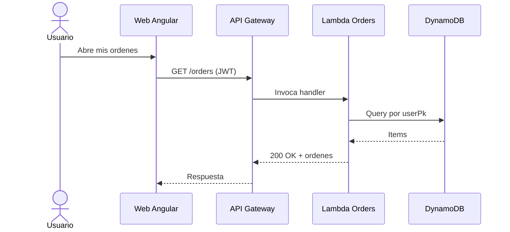
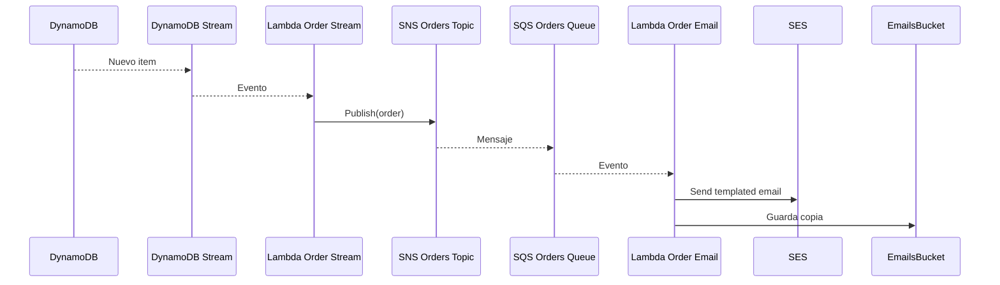
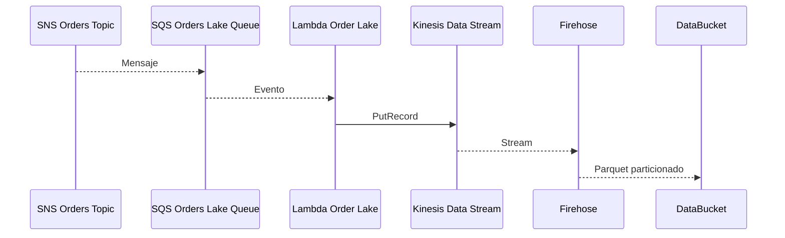

# Flujos (Mermaid)

Diagramas de secuencia para los flujos principales.

## Registro

## Login

## Salida (logout)

## Crear orden

## Leer ordenes

## Enviar email al crear orden

## Envio a data lake al crear orden

