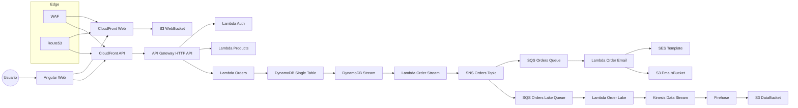

# Proyecto Final - Curso de Arquitecto de Soluciones AWS

[](https://github.com/fjbatresv/sdg19-final/actions/workflows/ci.yml)
[](https://github.com/fjbatresv/sdg19-final/actions/workflows/deploy.yml)
[](https://github.com/fjbatresv/sdg19-final/actions/workflows/docs-pages.yml)
[](LICENSE.md)


[](https://snyk.io/test/github/fjbatresv/sdg19-final)

Proyecto final del curso de Arquitecto de Soluciones AWS. Monorepo con Angular, Lambdas y CDK.

## Apps

- `apps/web`: frontend Angular 21
- `apps/backend`: Lambdas y contrato OpenAPI
- `apps/infra`: infraestructura CDK (VPC, CloudFront, Route53, WAF, Cognito, DynamoDB, S3)

## Dominios

- Web: `https://finalweb.<tu-dominio>`
- API: `https://finalapi.<tu-dominio>`

Los dominios se definen via contexto CDK o variables de entorno (`ROOT_DOMAIN_NAME`, `API_DOMAIN_NAME`, `WEB_DOMAIN_NAME`).

## Frontend API base URL

El frontend lee la URL de la API desde `window.__env.apiBaseUrl` cargado en `apps/web/src/assets/env.js`. En despliegues, reemplaza ese archivo (o inyecta la variable) para apuntar a tu API. En local, el fallback es `http://localhost:3000`.

## Arquitectura

Ver `ARCHITECTURE.md` y `architecture.drawio`.

Diagrama (Mermaid) basado en `architecture.drawio`:



## Observabilidad

Las Lambdas usan AWS X-Ray para trazabilidad distribuida.

## SonarCloud Scan

|Infra|Web|Backend|
|-|-|-|
|[](https://sonarcloud.io/summary/new_code?id=sdg19-infra)|[](https://sonarcloud.io/summary/new_code?id=sdg19-web)|[](https://sonarcloud.io/summary/new_code?id=sdg19-backend)|
|[](https://sonarcloud.io/summary/new_code?id=sdg19-infra)|[](https://sonarcloud.io/summary/new_code?id=sdg19-web)|[](https://sonarcloud.io/summary/new_code?id=sdg19-backend)|
|[](https://sonarcloud.io/summary/new_code?id=sdg19-infra)|[](https://sonarcloud.io/summary/new_code?id=sdg19-web)|[](https://sonarcloud.io/summary/new_code?id=sdg19-backend)|
|[](https://sonarcloud.io/summary/new_code?id=sdg19-infra)|[](https://sonarcloud.io/summary/new_code?id=sdg19-web)|[](https://sonarcloud.io/summary/new_code?id=sdg19-backend)|
|[](https://sonarcloud.io/summary/new_code?id=sdg19-infra)|[](https://sonarcloud.io/summary/new_code?id=sdg19-web)|[](https://sonarcloud.io/summary/new_code?id=sdg19-backend)|
|[](https://sonarcloud.io/summary/new_code?id=sdg19-infra)|[](https://sonarcloud.io/summary/new_code?id=sdg19-web)|[](https://sonarcloud.io/summary/new_code?id=sdg19-backend)|

## Desarrollo local

```bash
npx nx run web:serve
```

## Build

```bash
npx nx run @org/backend:build:production
npx nx run @org/infra:build:production
npx nx run web:build:production
```

## Documentación

La documentación vive en `docs-site/` (Astro Starlight) y `docs/api-typedoc/`
(TypeDoc).

GitHub Pages publica las docs en:

- Sitio principal (Starlight): https://fjbatresv.github.io/sdg19-final/
- API reference / playground: https://fjbatresv.github.io/sdg19-final/api-reference/
- Compodoc (frontend): https://fjbatresv.github.io/sdg19-final/compodoc/
- TypeDoc (backend): https://fjbatresv.github.io/sdg19-final/api-typedoc/

Badges de documentación:

- Compodoc coverage: <https://fjbatresv.github.io/sdg19-final/compodoc/images/coverage-badge-documentation.svg>
- Docs Pages workflow: <https://github.com/fjbatresv/sdg19-final/actions/workflows/docs-pages.yml>

```bash
npm run docs:dev
npm run docs:check
npm run docs:coverage
```

Para actualizar el contrato OpenAPI publicado en Starlight:

```bash
npm run docs:sync-openapi
```

Para generar el sitio estático de documentación:

```bash
npm run docs:build
```

Para levantar el preview local del build estático:

```bash
npm run docs:preview
```

Guías en Starlight:

- Astro Starlight: `docs-site/src/content/docs/astro.mdx`
- Compodoc: `docs-site/src/content/docs/compodoc.md`
- TypeDoc: `docs-site/src/content/docs/typedoc.mdx`

### Frontend Docs (Compodoc)


Publicado en GitHub Pages: https://fjbatresv.github.io/sdg19-final/

```bash
npx nx run web:docs
npx nx run web:docs:coverage
npx nx run web:docs:check
```

Guia completa: `docs-site/src/content/docs/compodoc.md`.

## Testing y coverage

Los tests se ejecutan por proyecto con cobertura >= 80% y generan LCOV en:

- Backend: `coverage/apps/backend/lcov.info`
- Frontend: `coverage/apps/web/lcov.info`
- Infra: `coverage/apps/infra/lcov.info`

```bash
npm run test:ci
npx nx run backend:test --configuration=ci
npx nx run web:test --configuration=ci
npx nx run infra:test --configuration=ci
```

Notas:
- `web:test --configuration=ci` corre unit tests (Vitest). No hay E2E configurado todavía.
- Los thresholds aplican a lines/statements/branches/functions.

Guía completa: `docs/testing.md`.

## Deploy (local)

```bash
export AWS_PROFILE=xxxx
AWS_REGION=<PRINCIPAL_REGION> npx cdk bootstrap aws://<AWS_ACCOUNT_ID>/<PRINCIPAL_REGION> -c hostedZoneId=<HOSTED_ZONE_ID>
AWS_REGION=<SECONDARY_REGION> npx cdk bootstrap aws://<AWS_ACCOUNT_ID>/<SECONDARY_REGION> -c hostedZoneId=<HOSTED_ZONE_ID>

AWS_REGION=<SECONDARY_REGION> npx cdk deploy Sdg19ReplicaStack --require-approval never -c hostedZoneId=<HOSTED_ZONE_ID>
AWS_REGION=<PRINCIPAL_REGION> npx cdk deploy Sdg19PrimaryStack --require-approval never -c hostedZoneId=<HOSTED_ZONE_ID>
```

## Deploy (GitHub Actions)

Antes de desplegar, revisa `DEPLOY.md` para crear el Hosted Zone, el OIDC
provider y el role con su policy.

### OIDC role para otras cuentas

La carpeta `oidc_role/` incluye JSON de referencia para crear un role OIDC
en otra cuenta y reutilizar este pipeline:

- `oidc_role/identity-provider.json`: datos del Identity Provider OIDC.
- `oidc_role/trust-relationship.json`: trust policy para GitHub Actions.
- `oidc_role/permission-policy.json`: permisos mínimos para CDK + deploy.

Reemplaza los placeholders:
- `$ACCOUNT_ID` por el ID de la cuenta destino.
- `repo:<user>/<repository name>:*` por el repo real (owner/nombre).

Luego crea el role con ese trust policy y adjunta la policy de permisos.
El `aws_role_name` en el `config_json` debe coincidir con el nombre de ese role.

Ejemplo de `config_json` para el workflow `deploy.yml` (input `config_json`):

```json
{
  "aws_account_id": "123456789012",
  "aws_region_primary": "us-east-1",
  "aws_region_replica": "us-east-2",
  "hosted_zone_id": "Z0ABCDEF1234567XYZ",
  "domains": {
    "root": "example.dev",
    "api": "api.example.dev",
    "web": "web.example.dev"
  },
  "ses": {
    "from": "no-reply@example.dev",
    "mail_from": "mail.example.dev"
  },
  "enable_lambda_vpc": false,
  "aws_role_name": "sdg19-deploy-role"
}
```

Campos del `config_json`:

- `aws_account_id`: cuenta AWS donde se despliega.
- `aws_region_primary`: región primaria (stacks principales).
- `aws_region_replica`: región de réplica (stack secundario).
- `hosted_zone_id`: Hosted Zone ID de Route53 para los dominios.
- `domains.root`: dominio raíz (ej. `tu-dominio.com`).
- `domains.api`: dominio para API (ej. `finalapi.tu-dominio.com`).
- `domains.web`: dominio para web (ej. `finalweb.tu-dominio.com`).
- `ses.from`: remitente verificado en SES (ej. `no-reply@tu-dominio.com`).
- `ses.mail_from`: subdominio MAIL FROM (ej. `mail.tu-dominio.com`).
- `enable_lambda_vpc`: `true`/`false` para habilitar VPC en Lambdas.
- `aws_role_name`: nombre del role a asumir.
- `emails_replica_kms_key_arn` (opcional): ARN de la KMS de la réplica (si ya existe).

El ARN del role se construye con `aws_account_id` + `aws_role_name`.

## Envio de correos (SES)

El stack crea la identidad de dominio SES, DKIM y MAIL FROM usando Route53.
Para enviar a cualquier destinatario necesitas sacar SES del sandbox.
La Lambda `order-email` valida formato básico de email, guarda una copia en S3
con estado `pending` antes del envío y la marca como `sent` al finalizar para
evitar reintentos duplicados.

Contexto recomendado en `cdk.json`:

- `rootDomainName`: dominio raiz (ej: `tu-dominio.com`) o `ROOT_DOMAIN_NAME`
- `apiDomainName`: dominio de API (ej: `finalapi.tu-dominio.com`) o `API_DOMAIN_NAME`
- `webDomainName`: dominio de web (ej: `finalweb.tu-dominio.com`) o `WEB_DOMAIN_NAME`
- `sesTemplateName`: nombre de plantilla SES (ej: `sdg19-order-confirmation`)
- `sesFromAddress`: remitente (ej: `noreply@tu-dominio`) o `SES_FROM_ADDRESS`
- `sesMailFromDomain`: subdominio MAIL FROM (ej: `mail.tu-dominio`) o `SES_MAIL_FROM_DOMAIN`

Ejemplo por CLI:

```bash
AWS_REGION=<PRINCIPAL_REGION> npx cdk deploy Sdg19PrimaryStack \
  -c hostedZoneId=<HOSTED_ZONE_ID> \
  -c rootDomainName=tu-dominio.com \
  -c apiDomainName=finalapi.tu-dominio.com \
  -c webDomainName=finalweb.tu-dominio.com \
  -c sesFromAddress=noreply@tu-dominio.com \
  -c sesMailFromDomain=mail.tu-dominio.com
```

Despues del deploy:

1. Verifica que los registros de Route53 se creen (DKIM + MAIL FROM).
2. Solicita salida de SES sandbox para enviar a cualquier correo. Guia oficial: [request production access](https://docs.aws.amazon.com/ses/latest/dg/request-production-access.html)

## Data lake (Fase 3)

Los eventos de ordenes se publican en SNS y se derivan a una cola SQS dedicada.
Una Lambda consume esos mensajes, los escribe en un Kinesis Data Stream y un
Firehose los entrega al bucket de datos (`DataBucket`) bajo el prefijo
`data-lake/orders/` en formato Parquet con particiones dinámicas
`year=YYYY/month=MM/day=DD/hour=HH/`.
