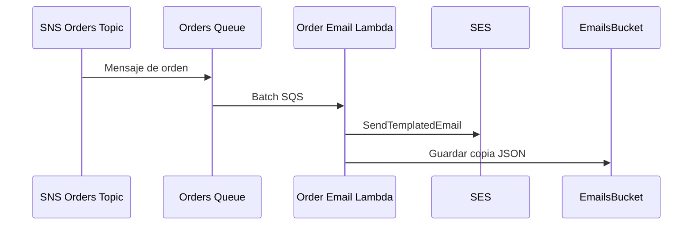

import Mermaid from '../../_components/Mermaid.astro';

El sistema de correos procesa las ordenes desde SQS y envia via SES.

Flujo:

<Mermaid />

Notas:

- La plantilla SES se versiona en CDK.
- Los objetos se cifran con SSE-KMS.
