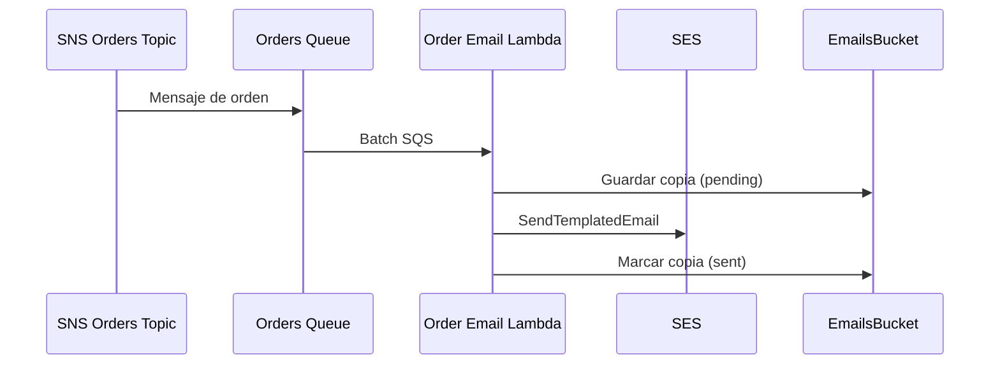

import Mermaid from '../../_components/Mermaid.astro';

El sistema de correos procesa las órdenes desde SQS y envía via SES. Antes de
enviar, valida el formato de email y guarda una copia en S3 con estado `pending`
para evitar reenvíos duplicados. Al completar el envío, marca la copia como
`sent`.

Flujo:

<Mermaid />

Notas:

- La plantilla SES se versiona en CDK.
- Los objetos se cifran con SSE-KMS.
- Las copias en S3 no almacenan el email; solo metadata y status.
