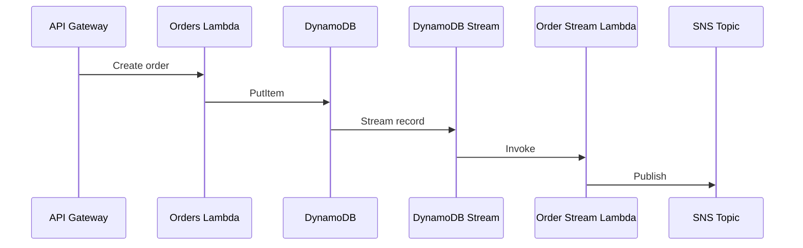

import Mermaid from '../../_components/Mermaid.astro';

## Endpoints

- `POST /auth/register`
- `POST /auth/login`
- `POST /auth/refresh`
- `GET /products` (cacheable en CloudFront)
- `POST /orders`
- `GET /orders`

## Flujo de ordenes

<Mermaid />
