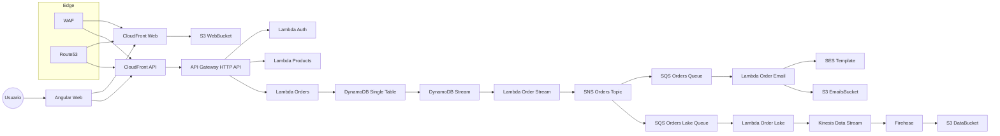

import Mermaid from '../_components/Mermaid.astro';

Bienvenido a la documentación del proyecto final. Esta solución cubre autenticación,
órdenes, envío de correos y data lake con infraestructura en AWS.

## Arquitectura general

<Mermaid />

## Fases completadas

- Fase 1: autenticación, productos y órdenes.
- Fase 2: envío de correos con SES.
- Fase 3: data lake con Kinesis + Firehose.
