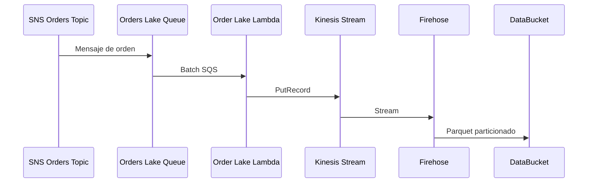

import Mermaid from '../../_components/Mermaid.astro';

El flujo de data lake toma las órdenes desde SNS y las persiste en S3:

<Mermaid />

Notas:

- SQS batching: usa batch size 5-10 (máximo 10) y visibility timeout >= 6x el
  timeout de Lambda; batches más grandes reducen costo pero aumentan latencia.
- Kinesis capacity: on-demand recomendado; en provisioned planear shards
  (1 MB/s write por shard) y auto-scaling/alarms para evitar throttling.
- S3 partitioning: `s3://<bucket>/orders/year=YYYY/month=MM/day=DD/hour=HH/`;
  vigila small files y programa compaction si el volumen es alto.
- Glue Catalog: usa crawler programado o gestión manual con versionado de
  esquema y validación antes de cambios.

Firehose:

- Conversión Parquet: columnas en orden `orderId (string)`, `userPk (string)`,
  `createdAt (timestamp)`, `status (string)`, `total (double)`, `items (string)`;
  compresión SNAPPY.
- Particiones dinámicas: `s3://<bucket>/orders/year=YYYY/month=MM/day=DD/hour=HH/`.
- Errores y reintentos: retries internos con backoff hasta ~300s; buffering
  mínimo 64 MB o 300s (requerido para conversión); registros fallidos van al
  prefijo de errores en S3 (ej. `errors/processing-failed/`) y se monitorean con
  CloudWatch Logs y alarmas.
