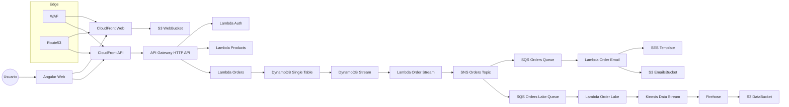

Bienvenido a la documentacion del proyecto final. Esta solucion cubre autenticacion,
ordenes, envio de correos y data lake con infraestructura en AWS.

## Arquitectura general

## Fases completadas

- Fase 1: autenticacion, productos y ordenes.
- Fase 2: envio de correos con SES.
- Fase 3: data lake con Kinesis + Firehose.
