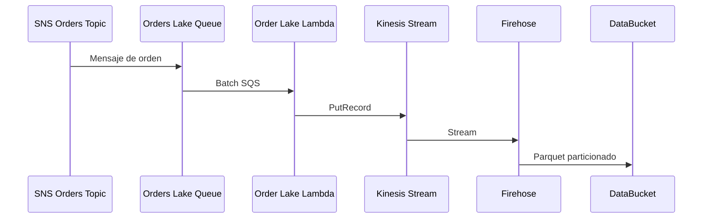

El flujo de data lake toma las ordenes desde SNS y las persiste en S3:

Notas:

- Firehose usa conversion a Parquet y particionado dinamico.
- Glue Catalog mantiene el esquema de la tabla de ordenes.
